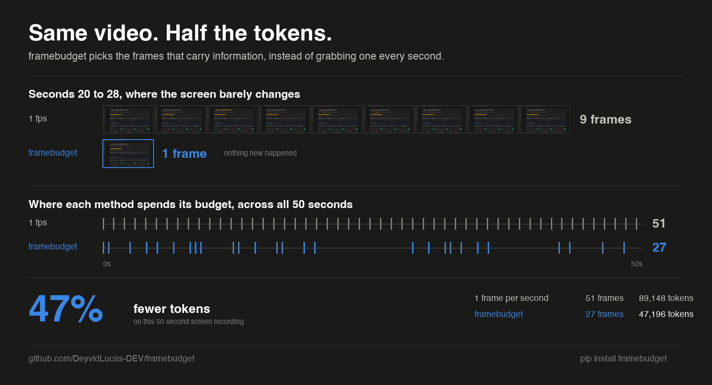

# framebudget

Fit a video into a token budget for multimodal LLMs.

You say how many tokens you are willing to spend. It picks the frames that say
the most about the video, and tells you what it saved.



```python
from framebudget import extract

result = extract("meeting.mp4", budget=50_000, target="claude")

print(result.report.summary())
messages = result.to_messages()
```

## What this actually does

Models do not watch video. They look at stills.

When you send a video to Claude, GPT or Gemini, something has to turn it into a
pile of images first, and every image costs tokens. A ten minute video at one
frame per second is 600 images, which is roughly 950,000 tokens on Claude. That
is expensive, and often past the context window entirely.

So almost everyone grabs frames on a timer: one per second, one per five
seconds. That is wrong in both directions at once.

**You pay for repetition.** A camera locked on a desk for two minutes gives you
120 near identical frames and you are billed for all of them.

**You still miss things.** Something on screen for half a second falls between
two grabs. The model never sees it, and nothing tells you it was lost.

framebudget watches the video first. It finds where the picture actually changes,
drops what repeats, and spends your budget on frames that carry new information.

The closest analogy is photographing a party. Shooting once a minute gets you
forty photos, twenty five of them of an empty table. Choosing forty photos of
the moments that differ gets you the whole party for the same price.

## Who this is for

If you are building any of these, this is the part you would otherwise write by
hand and get wrong:

- **Meeting and lecture summarisers.** The screen barely moves, so this is where
  the savings are largest.
- **Content moderation.** User uploaded video, at volume, on a per item budget.
- **Security and CCTV review.** Hours of footage where nothing happens and the
  few minutes that matter are the whole job.
- **Support and bug triage.** A three minute screen recording where the failure
  shows up for four seconds.
- **Media archives.** Cataloguing and searching a video library.

## Why it is worth doing properly

Adaptive selection is not just cheaper. Published work reports 8 to 10 points of
accuracy over uniform sampling on long video while using a fraction of the
frames.

That is unusual, and it is worth understanding why it happens. Normally you
trade cost against quality. Here they move together, because the waste and the
mistakes have the same cause: sampling by the clock instead of by content. Fix
the cause and both improve.

The cost side is not small either. At 100 videos a day, the gap between a good
frame policy and a careless one is the difference between roughly $104 and
$2,235 per day. Same videos, same questions, one parameter.

On a three minute slide deck, a run that would have cost 55,440 tokens comes out
at 18,788 with nothing distinct dropped. Tighten the budget and it goes to
2,772, which is 95 percent off.

## Install

```
pip install framebudget
```

Core install is light: numpy and OpenCV, no deep learning runtime, no ffmpeg
binary on your PATH. OpenCV brings its own decoders.

## How it works

Four stages.

**Scan.** Walk the file once and describe each sample with a brightness
normalised thumbnail and a colour histogram. Frames in between are advanced
without decoding, so scanning an hour of video does not cost an hour of decoding.

The sample rate is measured, not guessed. Sample a fast cutting video at 2 fps
and consecutive samples share nothing, so every one of them reads as a cut and
scene detection collapses. On a real estate tour that cuts every second, 2 fps
found 1 scene where there were 16; raising the rate to 8 found 15. So the scan
starts at 2 fps and doubles while the typical step between samples stays large.
Asking the user to pick this number would be the same guess the library exists
to remove.

The thumbnail is normalised for a reason. The obvious descriptor here is a
difference hash, and it falls apart on exactly the footage this library targets.
A hash compares neighbouring cells, and on a blank slide or a flat wall those
cells differ by sensor noise alone, so every bit is a coin flip. In testing, a
completely static shot scored 0.17 novelty out of 1.0 with a difference hash and
0.0004 with a normalised thumbnail. The first number makes a still video look
like constant change, which poisons everything downstream.

**Deduplicate.** Drop any sample too close to the last one kept. On static
footage this removes most of the file. Comparison is against the last kept frame
rather than the previous sample, so a slow pan accumulates change instead of
being discarded one frame at a time.

**Segment.** A cut is a sample that jumps far beyond what the current scene has
been doing, measured from the samples since the last cut. Not beyond a fixed
number, and not beyond the video average.

That framing is what survives both a locked off interview and a handheld chase.
In the interview the running level sits near zero and a cut towers over it. In
the chase the running level is already high, so the same absolute jump is
correctly read as more of the same motion. Any single threshold gets one of
those two badly wrong.

**Allocate.** Convert the token budget into a frame count using the target's
cost model, split it across scenes by weight, then pick frames inside each scene
by farthest point sampling. Even spacing in time gives you whatever was on
screen at fixed intervals. Spacing by appearance gives you distinct content.

The budget is a ceiling, not a target. Asking for 50k tokens does not mean
spending 50k on eighteen seconds of video, so the frame count is also capped by
what the video holds, at roughly three frames per scene. You get told what was
spent against what was allowed.

## Targets

Providers bill images differently enough to change the answer, so selection is
not provider agnostic.

| Target   | Cost per frame           | Default longest edge |
| -------- | ------------------------ | -------------------- |
| `claude` | width x height / 750     | 1568 px              |
| `openai` | 85 + 170 per 512 px tile | 2048 px              |
| `gemini` | 258 flat                 | 768 px               |

`to_messages()` returns content blocks already shaped for the target's API, with
a timestamp in front of every image. Models cannot infer ordering or spacing
from a pile of stills, and most questions about video are questions about time.

## CLI

```
framebudget meeting.mp4 --budget 50000 --target claude --out frames/
```

On a three minute deck of six slides followed by half a minute of motion:

```
duration     180.0s
scanned      360 samples at 2 fps
unique       61 (299 redundant dropped)
scenes       7
selected     61 frames, 100% of distinct content
tokens       18,788
baseline     55,440 (180 frames at 1 fps)
saved        +66.1%
```

Seven scenes for six cuts plus the opening, which is exactly right. Add `--json`
for machine readable output.

## Reading the report

**`coverage`** is the number to watch. It is the share of distinct content that
fit in the budget. At 100 percent nothing was dropped for cost. If it falls to
15 percent, real content was cut and the budget is the reason.

Time between frames is deliberately not reported as a warning. A 25 second gap
across a slide that never changes is the correct answer, not a problem, and
flagging it would train you to ignore the one metric that matters.

**`saved`** can go negative. That means the video holds more distinct content
than 1 fps would capture and the budget was large enough to pay for it. More
tokens, nothing missed. It is a real result, not a failure.

## Tuning

| Option          | Default   | Effect                                          |
| --------------- | --------- | ----------------------------------------------- |
| `analysis_fps`  | automatic | pin it only to override the measured rate       |
| `min_distance`  | 0.02      | redundancy floor, raise on noisy footage        |
| `sensitivity`   | 4.0       | times above the scene baseline to count as a cut |
| `max_dimension` | target    | lower to buy more frames with the same tokens   |

`min_distance` is deliberately conservative, and it cannot be tuned once for
everything. Slides differ from each other by a line of text, photographs differ
by the whole frame. Raising the floor to 0.2 works well on camera footage and
collapses a slide deck from 34 distinct frames to 2. If your material is text
heavy, leave it low.

## Limits

Worth knowing before you file an issue.

- Selection is content aware but not query aware. It does not know what you are
  going to ask. If you need frames relevant to one specific question, this gives
  you a good general summary, not the answer.
- No audio yet. Half the information in a talking head video is spoken and
  frames will never carry it. Planned behind the `audio` extra.
- Descriptors are perceptual, not semantic. Two visually similar frames with
  different text on screen can be deduplicated. Lower `min_distance` for slides
  and documents.
- Token counts are estimates. Providers round internally and change encodings.
  Use them to plan, then check a real invoice. The OpenAI blocks pin
  `detail: "high"` so the estimate and the bill describe the same request; left
  on `auto` the API silently picks a cheaper path on small frames and the two
  stop matching.
- Savings depend on the material, and can be negative. On a 50 second screen
  recording it cut 46 percent. On an 18 second promo cutting every second it
  spends more than 1 fps would, because 1 fps genuinely misses most of that
  video. It optimises where the budget goes, which is not the same as always
  spending less.

## License

MIT
